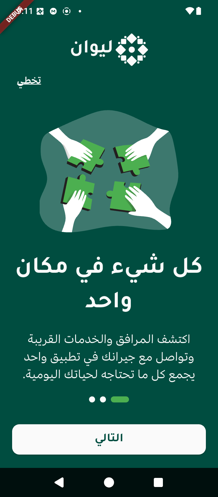
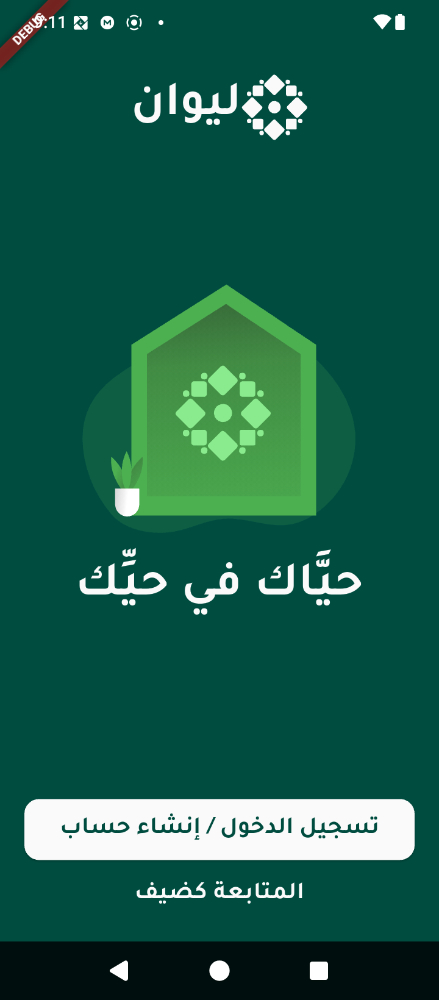

# Liwan App (ليوان)


# Figma url
# [(here)](https://www.figma.com/design/R5W9o2tEwdszPxqCMolH46/ROSHN-HACKTHON?node-id=4-5&t=BTpuF3SC1BnHB1eS-1)


A mobile application designed to bring neighbors together, foster a sense of community, and help residents connect with their local environment. The app encourages communication, provides vital information about the neighborhood, and keeps everyone updated on local events and facilities.

---
## Key Features ✨

* **Community Feed (الحي):** A social feed for residents to share news, post updates, and discuss neighborhood matters.
* **Neighbor Groups (الجيران):** Create and join group chats for specific buildings, streets, or shared interests (e.g., Mosque group, Building group).
* **Private Chat (الخاص):** A secure and private messaging feature for one-on-one conversations with neighbors.
* **Local Discovery:** Easily find information on local parks, government health facilities, and other public services.
* **Events Calendar:** Stay informed about current and upcoming local events and activities.
* **User Profiles:** A personalized profile for each resident to manage their information and interactions.

---
## Screenshots 📸

Here are some glimpses of the Liwan app in action:

| Splash Screen       | Onboarding 1           | Login            | Home Screen            |
| :------------------ | :--------------------- | :--------------------- | :--------------------- |
| |  |  |          |
| _The initial loading screen displaying the app's logo._ | _First step of the onboarding flow, highlighting community connection._ | _Second onboarding screen welcoming the user to their neighborhood._ | _The main dashboard, showing alerts, announcements, and quick access to sections._ |

---

---
## Project Structure

The project follows a clean and scalable feature-first folder structure.

```sh

├── assets
│   ├── fonts
│   ├── img
│   └── lang
│       ├── ar.json
│       └── en.json
│
├── lib
│   ├── commons
│   │   ├── controllers
│   │   └── widgets (Reusable UI components)
│   │
│   ├── screens
│   │   ├── coms (Community Chat Screens)
│   │   ├── explorer (Discovery Screen)
│   │   ├── home
│   │   ├── login
│   │   ├── navigation
│   │   ├── on_boarding
│   │   ├── profile
│   │   ├── signup
│   │   └── splash
│   │
│   ├── theme
│   │   ├── app_text_style.dart
│   │   └── app_theme.dart
│   │
│   └── main.dart
│
└── pubspec.yaml
```

Markdown

# Liwan App (ليوان)


A mobile application designed to bring neighbors together, foster a sense of community, and help residents connect with their local environment. The app encourages communication, provides vital information about the neighborhood, and keeps everyone updated on local events and facilities.

---
## Key Features ✨

* **Community Feed (الحي):** A social feed for residents to share news, post updates, and discuss neighborhood matters.
* **Neighbor Groups (الجيران):** Create and join group chats for specific buildings, streets, or shared interests (e.g., Mosque group, Building group).
* **Private Chat (الخاص):** A secure and private messaging feature for one-on-one conversations with neighbors.
* **Local Discovery:** Easily find information on local parks, government health facilities, and other public services.
* **Events Calendar:** Stay informed about current and upcoming local events and activities.
* **User Profiles:** A personalized profile for each resident to manage their information and interactions.

---
## Project Structure

The project follows a clean and scalable feature-first folder structure.

.
├── assets
│   ├── fonts
│   ├── img
│   └── lang
│       ├── ar.json
│       └── en.json
│
├── lib
│   ├── commons
│   │   ├── controllers
│   │   └── widgets (Reusable UI components)
│   │
│   ├── screens
│   │   ├── coms (Community Chat Screens)
│   │   ├── explorer (Discovery Screen)
│   │   ├── home
│   │   ├── login
│   │   ├── navigation
│   │   ├── on_boarding
│   │   ├── profile
│   │   ├── signup
│   │   └── splash
│   │
│   ├── theme
│   │   ├── app_text_style.dart
│   │   └── app_theme.dart
│   │
│   └── main.dart
│
└── pubspec.yaml


---
## Getting Started

### Prerequisites

* Flutter SDK (v3.0.0 or higher)
* An editor like VS Code or Android Studio

### Installation

1.  Clone the repository:
    ```sh
    git clone https://github.com/73azn/Liwan.git
    ```
2.  Navigate to the project directory:
    ```sh
    cd Liwan
    ```
3.  Install the required dependencies:
    ```sh
    flutter pub get
    ```

### Running the App

To run the application on your emulator or physical device, use the following command:
```sh
flutter run